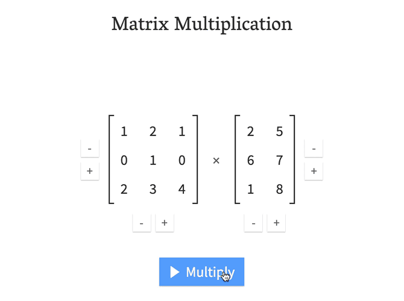

# Matrix Multiplication

> An interactive matrix multiplication calculator for educational purposes

**Visit [matrixmultiplication.xyz](http://matrixmultiplication.xyz).**



When I first learned about matrix multiplication in high school, it wasn't easy to memorize the method, and it didn't make sense. It felt like someone had invented a weird way of blending those numbers together. Why was it so natural and logical to multiply scalar numbers, but not so when it comes to matrices of numbers?

This question bothered me a few times until I studied math in the university. There, I had in total four linear algebra courses, so matrix multiplication became my bread-and-butter. One day it just snapped in my mind how the number of rows of the first matrix has to match the number of columns in the second matrix, which means they must perfectly align when the second matrix is rotated by 90°. From there, the second matrix trickles down, "combing" the values in the first matrix. The values are multiplied and added together. In my head, I called this the "waterfall method", and used it to perform my calculations in the university courses. It worked.

To this day, I'm not sure if this method has been discovered by others and taught in schools and universities. I haven't found anything similar on the web, at least. So I decided to build this matrix multiplication calculator to help visualize the waterfall method. I hope it will help clarify matrix multiplication for high school and college students, who like me, don't like to memorize arbitrary methods, but prefer self-evident mnemonics.

## Donate

I made this application out of my desire to help people around the world understand math. Often, students are short on budget and are in a hurry to learn. I don't want to get in their way. The website is straight-to-the-point, with no advertisements, no clutter, no sponsorships. It took me some days/weeks of work, plus the `.xyz` domain costs.

If you're not anymore a student and your pocket allows you, please donate some symbolic amount back. Consider it a way of saying thanks. Money received from this project, no matter the amount, will "taste" better to me than any other type of salary.

Send any amount of bitcoin to the address:

```
1bc8e3R56xRkEEiTPo9z6xJR3kBGALNE7
```

(You can verify that this address is indeed mine because the git commit that created this README.md file was signed with [my PGP key](https://keybase.io/andrestaltz))

:)

## For Cycle.js Developers

This codebase may serve as a good learning resource on how to structure Cycle.js apps. It's a bit larger than TodoMVC, but not too large, so it can be read in a few minutes or hours. It utilizes:

- xstream
- Cycle DOM
- Cycle onionify
- TypeScript
- TypeStyle (for CSS)
- Immutable.js (just a little bit, in one file)

The structure of the codebase is fractal. Directories with a capitalized name, like `App`, `Calculator`, `Matrix` are Cycle.js components. The top-level `index.ts` simply imports the App component and runs it as the top-level main function. Model-View-Intent is used in each component, but sometimes it grows large enough so that model is split into many files and grouped under a `model/` directory. Check `src/Calculator/intent`, as an example.

For more questions about this repository, open an issue or discuss in the Gitter chat. Enjoy. :)